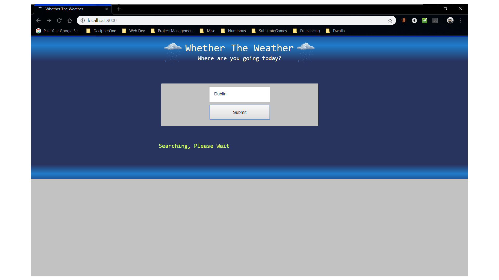
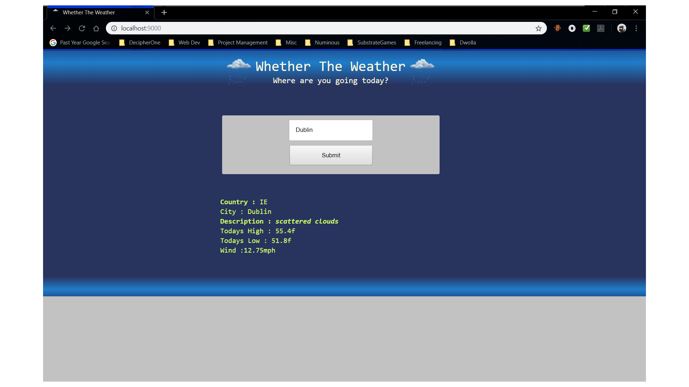

# OpenWeatherApp
Web app for querying openweathermap.org

## Build Status
- 

### Frame Works
- Scala Playframework
- jQuery

### Languages
- Scala
- Javascript
- Sass

### Directions

All Sass and javascript has been precompiled/minified to the respository, just use sbt to run the application.

